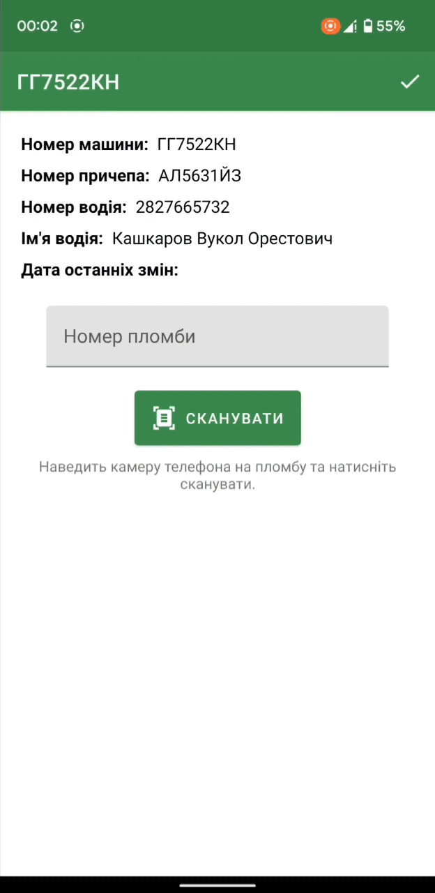
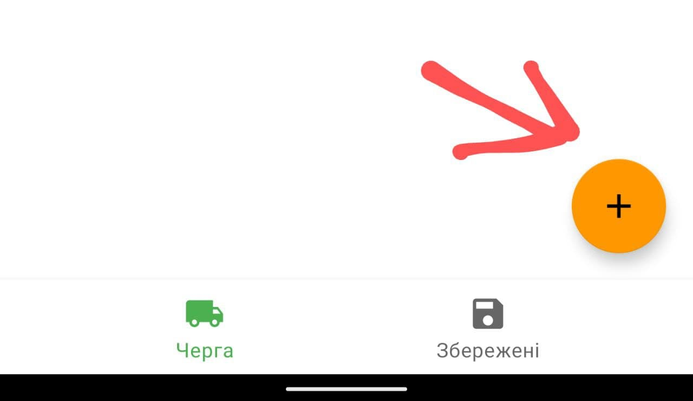
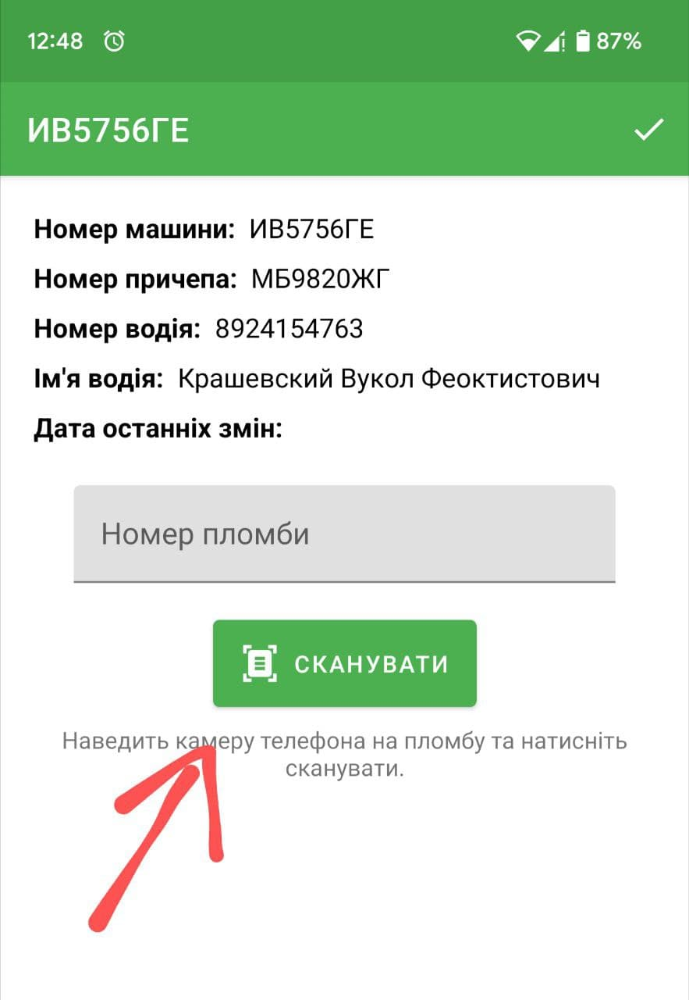
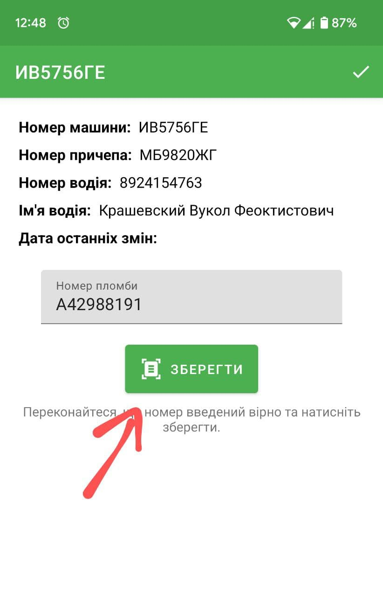
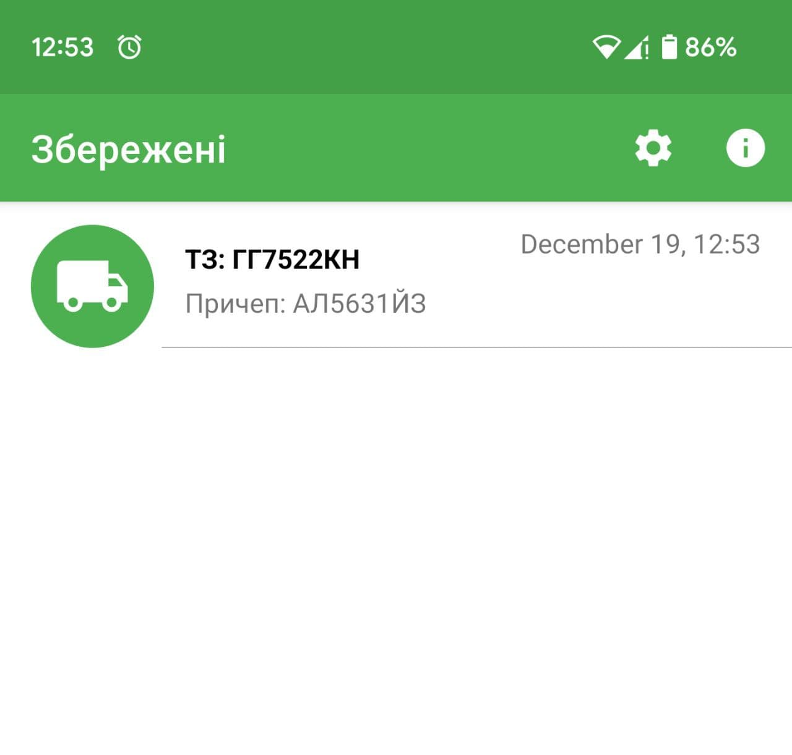
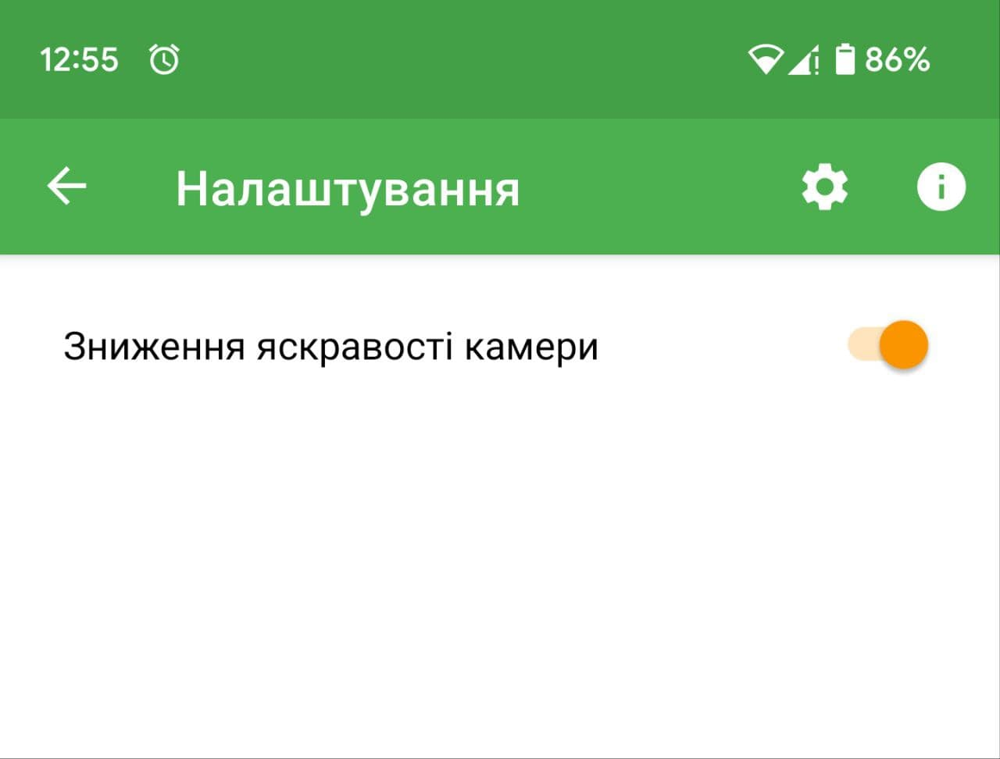

# Kernel Scanner
> Приложение для сканирования номеров пломб, разработано в рамках кейса от компании Kernel.

<p align="left">
  
</p>

## Содержание
- [Kernel Scanner](#kernel-scanner)
  - [Содержание](#содержание)
  - [Демонстрация](#демонстрация)
  - [Загрузить](#загрузить)
  - [Предисловие](#предисловие)
  - [Описание](#описание)
  - [Архитектура и технологии](#архитектура-и-технологии)
  - [Технологии](#технологии)
  - [Контакты](#контакты)


## Демонстрация
Видео демонстрации работы приложения:
[Видео на YouTube](https://youtu.be/6ZBTVu_l7QU)
<br/>

<p align="left">
  
</p>

## Загрузить
[Загрузить apk](description/KernelScanner-debug.apk)
<br/>


## Предисловие
Всем привет, я Носик Даниил студент третьего курса Харьковского национального университета радиоэлектроники, увлекаюсь андроид разработкой ещё со школы, узнав о вашем кейсе сразу захотелось приянть участие. 
Kernel Scanner - мой вариант решения вашей проблемы по считывани номеров пломб. О кейсе я узнал с большим запозданием (10го декабря) по этому не успел реализовать весь задуманый функционал, например облачное сохранение данных, но локально приложение полностью функционально.
При разарботке решил сосредоточиться на основном функционале, а именно самом процессе сканирование, таким образом удалось разработать функционал сканирования, без необходимости делать фото пломбы, то есть считывание текста происходит в режиме реального времени. Надеюсь правильно понял задачу и моя разработка может быть вам полезна.

## Описание
Поскольку у приложения работает локально и у него нет своего апи, то оно генерирует тестовые данные самостоятельно для этого нужно нажать на кнопеку "+" в меню "Черга". По нажатию на "+" в очередь будет добавлен груз со случайными данными.
<p align="left">
  
</p>

Далее можно перейти в любой груз из очереди и добавить в него необходимые пломбы. Для этого нужно нажать на элемент списка, направить камеру телефона на пломбу (для более быстро сканирование) затем нажать на кнопку "Сканувати", когда программа распознает на картинке код, фрагмент сканирования автоматически закроется и номер поместиться в поле для ввода. 
<p align="left">
  
</p>
Далее если номер был считан верно можно схранить его в список пломб (нажать на кнопку "зберегти") или же отредактировать нажав на поле для ввода номера. Приложение постоянно считывает ввод в текстовое поле номера и как только в нем появляется подходящий паттерн номера (а именно: одна первая буква и 8 цифр), оно позволяет сохранить номер. 
<p align="left">
  
</p>
После сохранения номер пломбы добавится в список пломб конкретного груза и обновится значения даты последних изменений. Так же если в грузе есть хотя б одна отсканированнная пломба, он автоматически перемещается в меню  "Збережені". 
<p align="left">
  
</p>
Так же эксперемтальным путем, я обнаружил, что снижения яркости (а точнее понижение экспозиции) передаваемого камерой изображения повышает точность и скорость обнаружения текста, особенно в темноте при свете вспышки. <br/>


```kotlin
camera.cameraControl.setExposureCompensationIndex(COMPENSATION_STEP)
```


<br/>
Во всяком случае это работало на устройствах на которых я проводил тестирование, по этому добавил возможность выключить эту функцию.
<p align="left">
  
</p>

## Архитектура и технологии
В качестве основной архитектуры приложения выбрал **MVVM**. Так же частично реализован паттерн **Single Activity**, использовать полностью одну активность на всё приложение не получилось, но в приложении всего две активности: **MainActivity** (в ней идёт навигация по фрагментам главного меню) и **CargoActivity** (активность где отображаются фрагменты информации о грузе и фрагмент сканирования). Фрагмент сканирования (**ScannerFragment**), является универсалльным единтсвенная функция которую он выполняет - это сканирование текста и поиск в нем нужного патерна сторки, затем когда нужная строка была найдена он завершает свое выполнение и возвращает номер как результат.

## Технологии
* [MLKIT](https://developers.google.com/ml-kit/vision/text-recognition) от Firebase. Основой распознования текста приложения является библиотке от Firebase - MLKIT, которая ориентирована на мобильные устройства и работает локально.
* [CameraX](https://developer.android.com/training/camerax) - используется для обработки изображения в реальном времени. Библиотка предостовляет удобный интерфейс для отображения изображения пользователю, а так же последующей его обработки. Хорошо сочитается с MLKIT
* [Room](https://developer.android.com/training/data-storage/room)
* [Analytics](https://firebase.google.com/docs/analytics/get-started?platform=android)
* [Crashlytics](https://firebase.google.com/docs/crashlytics/get-started?platform=android)

## Контакты
* Email: danya.nosik00@gmail.com 
* Telegram: @infinitum_1
